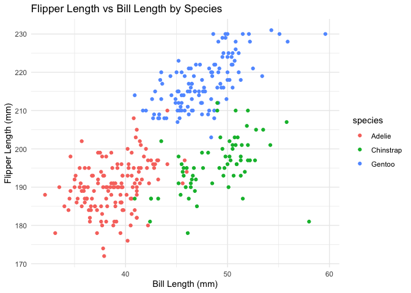

p8105_hw1_yl5830
================
Yunjia Liu
2024-09-21

## Question1

### 1.Load the penguins dataset

``` r
data("penguins", package = "palmerpenguins")
penguins_df <- penguins
```

### 2.Describe the penguins dataset

describe the dataset from several aspects, including the head of the
dataframe using head() function, the size of the dataframe using nrow()
& ncol(). In addition,calculate the mean of flipper_length_mm using
mean() function.(Note: already exclude all the possible missing numbers
in thr column of flipper_length_mm )

``` r
head(penguins,5)
```

    ## # A tibble: 5 × 8
    ##   species island    bill_length_mm bill_depth_mm flipper_length_mm body_mass_g
    ##   <fct>   <fct>              <dbl>         <dbl>             <int>       <int>
    ## 1 Adelie  Torgersen           39.1          18.7               181        3750
    ## 2 Adelie  Torgersen           39.5          17.4               186        3800
    ## 3 Adelie  Torgersen           40.3          18                 195        3250
    ## 4 Adelie  Torgersen           NA            NA                  NA          NA
    ## 5 Adelie  Torgersen           36.7          19.3               193        3450
    ## # ℹ 2 more variables: sex <fct>, year <int>

``` r
num_rows = nrow(penguins_df)
num_cols = ncol(penguins_df)
cat("The dataset has", num_rows, "rows and", num_cols, "columns.\n")
```

    ## The dataset has 344 rows and 8 columns.

``` r
mean_flipper_length = mean(penguins_df$flipper_length_mm, na.rm = TRUE)
cat("The mean flipper length is", mean_flipper_length, "mm.\n")
```

    ## The mean flipper length is 200.9152 mm.

### 3. Scatterplot of flipper_length_mm (y) vs bill_length_mm (x) with color points using the species variable

3.1 Remove rows with missing values to avoid errors in plotting

3.2 Draw the scatterplot of flipper_length_mm vs bill_length_mm

``` r
penguins_df_clean = na.omit(penguins_df)
scatterplot_flipper_bill = ggplot(penguins_df_clean, aes(x = bill_length_mm, y = flipper_length_mm, color = species)) +
  geom_point() +
  labs(x = "Bill Length (mm)", y = "Flipper Length (mm)", title = "Flipper Length vs Bill Length by Species") +
  theme_minimal()

print(scatterplot_flipper_bill)
```

<!-- -->

``` r
ggsave(filename = "flipper_vs_bill_length_plot.png", plot = scatterplot_flipper_bill, width = 8, height = 6)
```
